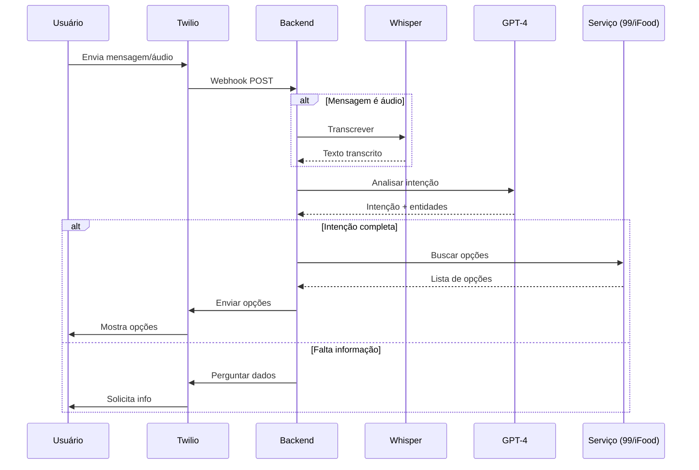

# BRIEFING TÉCNICO
## MVP Ajuda Fácil — Assistente WhatsApp para Adultos 40+

**Versão:** 1.0  
**Data:** Janeiro 2026  
**Confidencial**

---

## 1. VISÃO GERAL DO PRODUTO

### 1.1 Descrição

O **Ajuda Fácil** é um assistente de inteligência artificial via WhatsApp que permite que adultos 40+ utilizem serviços de transporte, delivery e farmácia por meio de mensagens de texto ou áudio, sem precisar navegar em aplicativos complexos.

### 1.2 Problema

- 54.6 milhões de brasileiros 40+ estão online
- 93% usam WhatsApp
- 67% têm dificuldade significativa com aplicativos

### 1.3 Solução

O usuário envia uma mensagem no WhatsApp (texto ou áudio) descrevendo o que precisa. O sistema:
1. Entende a intenção usando GPT-4
2. Busca opções nos serviços integrados
3. Apresenta opções simplificadas
4. Executa o pedido após confirmação

### 1.4 Exemplo de Fluxo

```
USUÁRIO: 🎤 "Quero ir pro shopping Iguatemi"

BOT: Encontrei essas opções pra você:
     🚗 99Pop - R$ 18,90 (5 min)
     🚙 99Comfort - R$ 24,50 (7 min)
     Qual você prefere?

USUÁRIO: O primeiro

BOT: Perfeito! ✅ Corrida confirmada!
     Motorista João chegando em 5 min.
     Carro: Onix Prata - ABC-1234
```

---

## 2. ARQUITETURA DO SISTEMA

### 2.1 Diagrama de Alto Nível

```
┌─────────────────────────────────────────────────────────────────────┐
│                           USUÁRIO                                    │
│                      (WhatsApp Mobile)                               │
└─────────────────────────────────────────────────────────────────────┘
                                │
                                ▼
┌─────────────────────────────────────────────────────────────────────┐
│                       TWILIO WHATSAPP API                            │
│                    (Mensagens + Webhooks)                            │
└─────────────────────────────────────────────────────────────────────┘
                                │
                                ▼
┌─────────────────────────────────────────────────────────────────────┐
│                        BACKEND NODE.JS                               │
│  ┌──────────────┐  ┌──────────────┐  ┌──────────────┐               │
│  │   Webhook    │  │   Message    │  │  Integration │               │
│  │   Handler    │──│   Processor  │──│   Manager    │               │
│  └──────────────┘  └──────────────┘  └──────────────┘               │
│         │                  │                  │                      │
│         ▼                  ▼                  ▼                      │
│  ┌──────────────┐  ┌──────────────┐  ┌──────────────┐               │
│  │    Audio     │  │    GPT-4     │  │    API       │               │
│  │  Transcriber │  │   Engine     │  │   Clients    │               │
│  │  (Whisper)   │  │              │  │ (99/iFood)   │               │
│  └──────────────┘  └──────────────┘  └──────────────┘               │
└─────────────────────────────────────────────────────────────────────┘
                                │
                                ▼
┌─────────────────────────────────────────────────────────────────────┐
│                         POSTGRESQL                                   │
│        (Usuários, Conversas, Pedidos, Lembretes)                    │
└─────────────────────────────────────────────────────────────────────┘
                                │
                                ▼
┌─────────────────────────────────────────────────────────────────────┐
│                      AWS INFRASTRUCTURE                              │
│   ┌─────────┐    ┌─────────┐    ┌─────────┐    ┌─────────┐         │
│   │   ECS   │    │   RDS   │    │   S3    │    │CloudWatch│         │
│   │(Backend)│    │(Postgres)│   │(Mídia)  │    │ (Logs)  │         │
│   └─────────┘    └─────────┘    └─────────┘    └─────────┘         │
└─────────────────────────────────────────────────────────────────────┘
```

### 2.2 Componentes

| Componente | Tecnologia | Responsabilidade |
|------------|------------|------------------|
| API Gateway | Express.js | Recebe webhooks Twilio |
| Message Processor | Node.js | Orquestra fluxo de mensagens |
| AI Engine | OpenAI GPT-4 | Entende intenção, gera respostas |
| Audio Transcriber | OpenAI Whisper | Converte áudio em texto |
| Integration Manager | Node.js | Conecta com 99, iFood, farmácias |
| Database | PostgreSQL | Persiste dados |
| Cache | Redis | Session state, rate limiting |
| Queue | AWS SQS | Processamento assíncrono |

---

## 3. FLUXO PRINCIPAL DO USUÁRIO

### 3.1 Fluxo de Mensagem



### 3.2 Estados da Conversa

| Estado | Descrição | Próximos Estados |
|--------|-----------|------------------|
| `IDLE` | Aguardando mensagem | UNDERSTANDING |
| `UNDERSTANDING` | Processando intenção | COLLECTING, SEARCHING |
| `COLLECTING` | Coletando informações | SEARCHING |
| `SEARCHING` | Buscando opções | CONFIRMING |
| `CONFIRMING` | Aguardando confirmação | EXECUTING, IDLE |
| `EXECUTING` | Executando pedido | TRACKING |
| `TRACKING` | Acompanhando pedido | IDLE |

---

## 4. FUNCIONALIDADES DO MVP

### 4.1 Prioridade P0 (Essencial - Lançamento)

| ID | Funcionalidade | Descrição | Horas |
|----|----------------|-----------|-------|
| P0-1 | Receber mensagens | Webhook Twilio, parsing | 8h |
| P0-2 | Transcrição de áudio | Integração Whisper | 8h |
| P0-3 | Entendimento de intenção | GPT-4 para classificar | 16h |
| P0-4 | Gerenciamento de conversa | Estado, contexto, histórico | 24h |
| P0-5 | Respostas naturais | Geração de texto humanizado | 8h |
| P0-6 | Banco de dados | Schema, queries, migrations | 16h |
| P0-7 | Autenticação WhatsApp | Identificar usuário por número | 8h |
| | **Subtotal P0** | | **88h** |

### 4.2 Prioridade P1 (Core Features)

| ID | Funcionalidade | Descrição | Horas |
|----|----------------|-----------|-------|
| P1-1 | Integração 99 | API 99 para corridas | 40h |
| P1-2 | Integração iFood | API iFood para delivery | 40h |
| P1-3 | Confirmação de pedido | Fluxo de confirmação | 16h |
| P1-4 | Notificações | Status da corrida/entrega | 16h |
| P1-5 | Histórico de pedidos | Consultar pedidos anteriores | 8h |
| | **Subtotal P1** | | **120h** |

### 4.3 Prioridade P2 (Nice to Have)

| ID | Funcionalidade | Descrição | Horas |
|----|----------------|-----------|-------|
| P2-1 | Sistema de lembretes | Agendar lembretes de remédio | 24h |
| P2-2 | Dashboard admin | Painel básico de gestão | 32h |
| P2-3 | Integração farmácias | API Drogasil/Pacheco | 40h |
| P2-4 | Pagamento in-app | Processar pagamentos | 40h |
| P2-5 | Analytics | Métricas de uso | 16h |
| | **Subtotal P2** | | **152h** |

### 4.4 Resumo de Horas

| Prioridade | Horas | % do Total |
|------------|-------|------------|
| P0 | 88h | 24% |
| P1 | 120h | 33% |
| P2 | 152h | 42% |
| **Total** | **360h** | 100% |

---

## 5. REQUISITOS NÃO-FUNCIONAIS

### 5.1 Performance

| Métrica | Requisito | Justificativa |
|---------|-----------|---------------|
| Latência de resposta | < 5 segundos | Experiência de chat natural |
| Transcrição de áudio | < 3 segundos | Áudios curtos (< 30s) |
| Tempo de busca API | < 10 segundos | Aguardar opções |

### 5.2 Disponibilidade

| Métrica | Requisito |
|---------|-----------|
| Uptime | 99.5% (43h downtime/mês máx) |
| Recovery Time | < 30 minutos |
| Backup | Diário, retenção 30 dias |

### 5.3 Escalabilidade

| Métrica | Fase 1 | Fase 2 | Fase 3 |
|---------|--------|--------|--------|
| Usuários ativos | 100 | 1.000 | 10.000 |
| Mensagens/dia | 1.000 | 10.000 | 100.000 |
| Infraestrutura | 1 instância | 2 instâncias | Auto-scaling |

### 5.4 Segurança

- HTTPS obrigatório
- Validação de webhook Twilio
- Dados sensíveis encriptados (AES-256)
- LGPD compliance (consentimento, exclusão de dados)
- Rate limiting (100 msgs/min/usuário)
- Logs auditáveis

---

## 6. STACK TECNOLÓGICO

### 6.1 Backend

| Camada | Tecnologia | Versão |
|--------|------------|--------|
| Runtime | Node.js | 20 LTS |
| Framework | Express.js | 4.x |
| Linguagem | TypeScript | 5.x |
| ORM | Prisma | 5.x |
| Validação | Zod | 3.x |
| Testes | Jest + Supertest | - |

### 6.2 Banco de Dados

| Tipo | Tecnologia | Uso |
|------|------------|-----|
| Relacional | PostgreSQL 15 | Dados principais |
| Cache | Redis 7 | Sessões, filas |
| Fila | AWS SQS | Jobs assíncronos |

### 6.3 Infraestrutura (AWS)

| Serviço | Uso |
|---------|-----|
| ECS Fargate | Containers do backend |
| RDS PostgreSQL | Banco de dados |
| ElastiCache Redis | Cache |
| S3 | Armazenamento de mídia |
| CloudWatch | Logs e monitoramento |
| Route 53 | DNS |
| ACM | Certificados SSL |

### 6.4 Serviços Externos

| Serviço | Função | Documentação |
|---------|--------|--------------|
| Twilio | WhatsApp API | twilio.com/docs/whatsapp |
| OpenAI GPT-4 | Processamento de linguagem | platform.openai.com/docs |
| OpenAI Whisper | Transcrição de áudio | platform.openai.com/docs |
| 99 | API de transporte | (parceria necessária) |
| iFood | API de delivery | (parceria necessária) |

---

## 7. SCHEMA DO BANCO DE DADOS

### 7.1 Diagrama ER

```
┌──────────────────┐       ┌──────────────────┐
│      users       │       │   conversations  │
├──────────────────┤       ├──────────────────┤
│ id (PK)          │1     *│ id (PK)          │
│ phone_number     │───────│ user_id (FK)     │
│ name             │       │ status           │
│ created_at       │       │ context (JSON)   │
│ preferences      │       │ created_at       │
│ is_active        │       │ updated_at       │
└──────────────────┘       └──────────────────┘
                                    │
                                    │ 1
                                    │
                                    ▼ *
                           ┌──────────────────┐
                           │     messages     │
                           ├──────────────────┤
                           │ id (PK)          │
                           │ conversation_id  │
                           │ role (user/bot)  │
                           │ content          │
                           │ media_url        │
                           │ created_at       │
                           └──────────────────┘

┌──────────────────┐       ┌──────────────────┐
│      orders      │       │    reminders     │
├──────────────────┤       ├──────────────────┤
│ id (PK)          │       │ id (PK)          │
│ user_id (FK)     │       │ user_id (FK)     │
│ type (ride/food) │       │ title            │
│ provider (99...)  │       │ scheduled_at     │
│ status           │       │ repeat_type      │
│ external_id      │       │ is_active        │
│ details (JSON)   │       │ created_at       │
│ created_at       │       └──────────────────┘
└──────────────────┘
```

### 7.2 Tabelas Principais

```sql
-- Usuários
CREATE TABLE users (
    id UUID PRIMARY KEY DEFAULT gen_random_uuid(),
    phone_number VARCHAR(20) UNIQUE NOT NULL,
    name VARCHAR(100),
    preferences JSONB DEFAULT '{}',
    is_active BOOLEAN DEFAULT true,
    created_at TIMESTAMP DEFAULT NOW(),
    updated_at TIMESTAMP DEFAULT NOW()
);

-- Conversas
CREATE TABLE conversations (
    id UUID PRIMARY KEY DEFAULT gen_random_uuid(),
    user_id UUID REFERENCES users(id),
    status VARCHAR(20) DEFAULT 'active',
    context JSONB DEFAULT '{}',
    created_at TIMESTAMP DEFAULT NOW(),
    updated_at TIMESTAMP DEFAULT NOW()
);

-- Mensagens
CREATE TABLE messages (
    id UUID PRIMARY KEY DEFAULT gen_random_uuid(),
    conversation_id UUID REFERENCES conversations(id),
    role VARCHAR(10) NOT NULL, -- 'user' ou 'assistant'
    content TEXT NOT NULL,
    media_url TEXT,
    metadata JSONB DEFAULT '{}',
    created_at TIMESTAMP DEFAULT NOW()
);

-- Pedidos
CREATE TABLE orders (
    id UUID PRIMARY KEY DEFAULT gen_random_uuid(),
    user_id UUID REFERENCES users(id),
    type VARCHAR(20) NOT NULL, -- 'ride', 'food', 'pharmacy'
    provider VARCHAR(50) NOT NULL, -- '99', 'ifood', etc
    status VARCHAR(20) DEFAULT 'pending',
    external_id VARCHAR(100),
    details JSONB NOT NULL,
    created_at TIMESTAMP DEFAULT NOW(),
    updated_at TIMESTAMP DEFAULT NOW()
);
```

---

## 8. APIs E INTEGRAÇÕES

### 8.1 API Interna (REST)

| Endpoint | Método | Descrição |
|----------|--------|-----------|
| `/webhook/whatsapp` | POST | Recebe mensagens Twilio |
| `/webhook/twilio/status` | POST | Status de entrega |
| `/api/users` | GET | Lista usuários (admin) |
| `/api/orders` | GET | Lista pedidos (admin) |
| `/api/analytics` | GET | Métricas (admin) |
| `/health` | GET | Health check |

### 8.2 Integrações Externas

#### Twilio WhatsApp

```javascript
// Enviar mensagem
POST https://api.twilio.com/2010-04-01/Accounts/{AccountSid}/Messages.json
{
    "To": "whatsapp:+5511999999999",
    "From": "whatsapp:+14155238886",
    "Body": "Sua corrida chegou!"
}
```

#### OpenAI GPT-4

```javascript
// Processar intenção
POST https://api.openai.com/v1/chat/completions
{
    "model": "gpt-4o-mini",
    "messages": [
        {"role": "system", "content": "..."},
        {"role": "user", "content": "Quero ir pro shopping"}
    ]
}
```

#### OpenAI Whisper

```javascript
// Transcrever áudio
POST https://api.openai.com/v1/audio/transcriptions
{
    "file": <audio_file>,
    "model": "whisper-1",
    "language": "pt"
}
```

### 8.3 Integrações Pendentes (Requer Parceria)

| Serviço | Status | Contato |
|---------|--------|---------|
| 99 | Pendente | developers.99app.com |
| iFood | Pendente | Portal de parceiros |
| Drogasil | Pendente | Comercial |

> ⚠️ **Nota:** As APIs de 99 e iFood requerem parceria comercial. Durante o MVP, pode-se usar simulação ou integração via web scraping (não recomendado para produção).

---

## 9. CRONOGRAMA (12 SEMANAS)

### 9.1 Visão Geral

```
Semana:  1   2   3   4   5   6   7   8   9  10  11  12
         ▓▓▓▓▓▓▓▓▓▓▓▓▓▓▓▓▓▓▓▓▓▓▓▓▓▓▓▓▓▓▓▓▓▓▓▓▓▓▓▓▓▓▓▓
Setup    ████
Core         ████████████
P0                       ████████
P1                               ████████████
Testes                                       ████████
Deploy                                               ████
```

### 9.2 Detalhamento por Semana

| Semana | Fase | Entregas |
|--------|------|----------|
| 1-2 | Setup | Ambiente, CI/CD, estrutura do projeto |
| 3-4 | Core | Webhook Twilio, integração OpenAI |
| 5-6 | P0 | Fluxo de conversa, transcrição, DB |
| 7-8 | P1 | Integração 99 (ou mock) |
| 9-10 | P1 | Integração iFood (ou mock) |
| 11 | Testes | QA, correções, otimizações |
| 12 | Deploy | Produção, documentação, handoff |

### 9.3 Marcos (Milestones)

| Data | Marco | Critério de Aceite |
|------|-------|-------------------|
| Sem 2 | M1: Ambiente pronto | CI/CD funcionando, deploy staging |
| Sem 4 | M2: Bot conversando | Responde via WhatsApp com GPT |
| Sem 6 | M3: Core completo | Transcrição + contexto + DB |
| Sem 8 | M4: 99 integrado | Pedir corrida end-to-end |
| Sem 10 | M5: iFood integrado | Pedir comida end-to-end |
| Sem 12 | M6: MVP lançado | Em produção com 10 usuários beta |

---

## 10. ESTIMATIVA DE CUSTOS

### 10.1 Custos de Desenvolvimento

| Item | Horas | Valor/Hora | Total |
|------|-------|------------|-------|
| P0 (Essencial) | 88h | R$ 150 | R$ 13.200 |
| P1 (Core) | 120h | R$ 150 | R$ 18.000 |
| P2 (Extras) | 152h | R$ 150 | R$ 22.800 |
| **Total** | **360h** | | **R$ 54.000** |

> 💡 Valores de referência para desenvolvedor sênior freelancer. Agências podem custar 50-100% a mais.

### 10.2 Custos de Infraestrutura (Mensal)

| Serviço | Custo/Mês |
|---------|-----------|
| AWS ECS + RDS + Redis | R$ 400-800 |
| Twilio (10k msgs) | R$ 250-500 |
| OpenAI (10k msgs) | R$ 50-100 |
| Domínio + SSL | R$ 50 |
| **Total** | **R$ 750-1.450/mês** |

---

## 11. CRITÉRIOS DE ACEITE DO MVP

### 11.1 Funcionalidades

- [ ] Usuário envia texto → recebe resposta em < 5s
- [ ] Usuário envia áudio → transcrito e processado
- [ ] Bot entende "quero ir pro shopping" como pedido de corrida
- [ ] Bot apresenta opções de corrida com preço
- [ ] Usuário confirma → pedido é registrado
- [ ] Histórico de conversa mantido por 24h

### 11.2 Qualidade

- [ ] Cobertura de testes > 70%
- [ ] Zero vulnerabilidades críticas
- [ ] Documentação de API completa
- [ ] Logs estruturados funcionando

### 11.3 Deploy

- [ ] Ambiente de staging funcionando
- [ ] Ambiente de produção configurado
- [ ] Monitoramento ativo
- [ ] Playbook de incidentes documentado

---

## 12. ENTREGÁVEIS ESPERADOS

| # | Entregável | Formato |
|---|------------|---------|
| 1 | Código-fonte | Repositório GitHub privado |
| 2 | Documentação técnica | Markdown no repositório |
| 3 | Documentação de API | OpenAPI/Swagger |
| 4 | Testes automatizados | Jest |
| 5 | Scripts de deploy | Dockerfile + terraform |
| 6 | Ambiente staging | URL funcional |
| 7 | Ambiente produção | URL funcional |
| 8 | Runbook operacional | PDF/Notion |

---

## 13. CONTATO E PRÓXIMOS PASSOS

### 13.1 Para Candidatar-se

Enviar para: **[EMAIL]**

1. Portfolio com projetos similares (chatbots, integrações API)
2. Estimativa de horas e cronograma
3. Proposta comercial
4. Disponibilidade de início

### 13.2 Processo de Seleção

1. Análise de portfolio
2. Call técnica (30 min)
3. Teste técnico pequeno (2h)
4. Proposta e contrato

---

## ANEXOS

### A. Glossário

| Termo | Definição |
|-------|-----------|
| MVP | Minimum Viable Product - produto mínimo viável |
| Webhook | URL que recebe eventos em tempo real |
| LLM | Large Language Model - modelo de linguagem (GPT) |
| Whisper | Modelo da OpenAI para transcrição de áudio |
| LGPD | Lei Geral de Proteção de Dados |

### B. Referências

- Twilio WhatsApp API: https://www.twilio.com/docs/whatsapp
- OpenAI API: https://platform.openai.com/docs
- 99 para empresas: https://99app.com/empresas
- iFood para parceiros: https://parceiros.ifood.com.br

---

*Documento confidencial - Ajuda Fácil © 2026*
